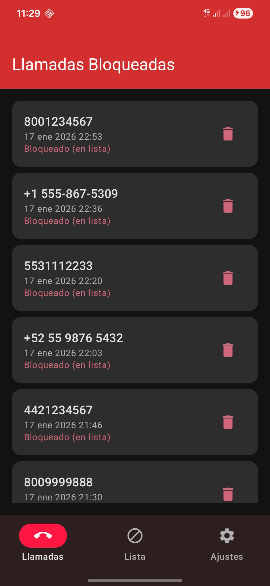
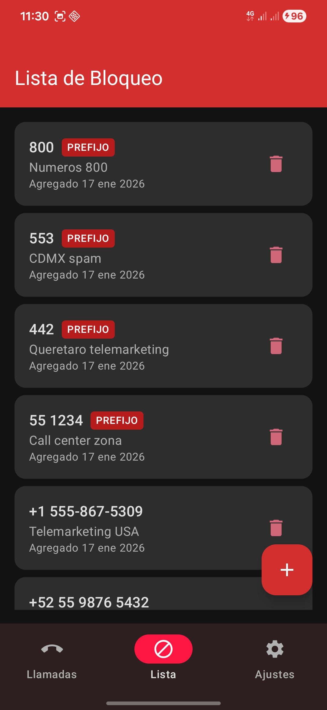
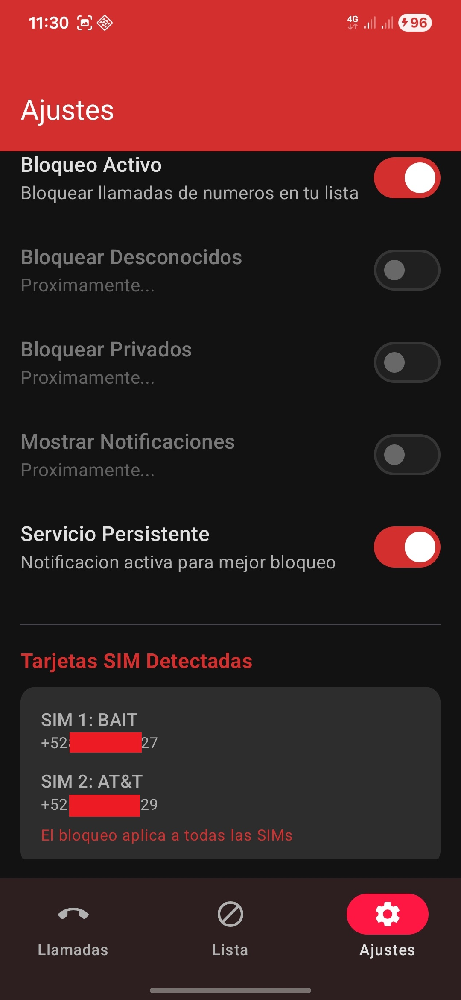
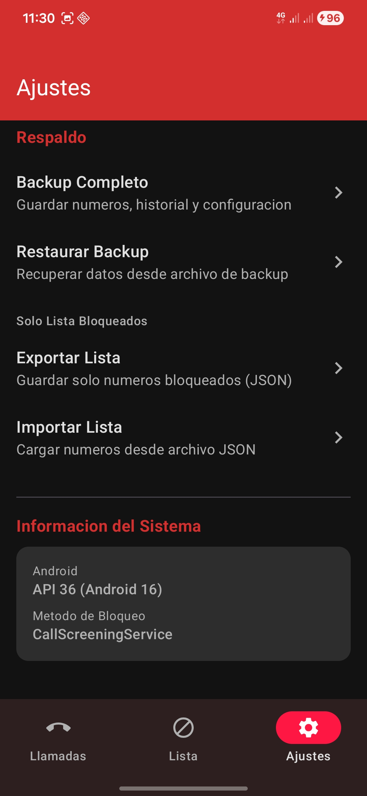

# Call Blocker (web26-050)

Android app to block unwanted calls.

[](https://www.gnu.org/licenses/gpl-3.0)
[](https://gitlab.com/fdroid/fdroiddata/-/merge_requests/32092)

## Screenshots

<p align="center">
  
  
  
  
</p>

## Stack

- **Language**: Kotlin
- **UI**: Jetpack Compose + Material 3
- **Architecture**: Clean Architecture + MVVM
- **DI**: Hilt
- **Database**: Room
- **Min SDK**: 28 (Android 9+)

## Requirements

- JDK 17
- Android SDK 34
- Device/Emulator Android 9+ (API 28+)

## Build

### On server (server005)

```bash
cd /home/ubuntu/projects/web26-050-call-blocker

# Build debug APK
./gradlew assembleDebug --no-daemon

# Output
ls app/build/outputs/apk/debug/app-debug.apk
```

### Local (Android Studio)

```bash
# Clone
git clone <repo-url>
cd web26-050-call-blocker

# Open in Android Studio and sync Gradle
# Or from CLI:
./gradlew assembleDebug
```

### Install on device

```bash
adb install app/build/outputs/apk/debug/app-debug.apk
```

## Project Structure

```
app/src/main/java/com/callblocker/
|-- core/
|   |-- di/              # Hilt modules
|   |-- service/         # CallScreeningService
|   +-- receiver/        # BootReceiver
|
|-- data/
|   |-- local/
|   |   |-- entity/      # Room entities
|   |   |-- dao/         # Room DAOs
|   |   +-- migration/   # Room migrations
|   +-- repository/      # Repository implementations
|
|-- domain/
|   |-- model/           # Domain models
|   |-- repository/      # Repository interfaces
|   +-- usecase/         # Use cases
|
+-- presentation/
    |-- components/      # Reusable composables
    |-- navigation/      # Navigation setup
    |-- screens/         # Screens (ViewModels + Composables)
    +-- theme/           # Material 3 theme
```

## Features

- [x] Block specific numbers
- [x] **Block by prefix** (e.g.: 442 blocks all numbers starting with 442)
- [x] View blocked calls history
- [x] Configure blocking of private numbers
- [x] **Dual SIM support** - individual blocking per card
- [x] **Dark theme** forced for better readability
- [x] **Interface in Spanish and English**
- [x] Compatible with Android 9 - 17
- [x] **Complete Backup/Restore** with optional AES-256-GCM encryption
- [ ] Blocked call notifications

## Prefix Blocking

Feature that allows blocking number ranges:

1. Open the app > Block List > (+) button
2. Enter the prefix (e.g.: "442")
3. Enable "Block as prefix" switch
4. Save

All numbers starting with that prefix will be blocked.

## Backup and Restore

### Complete Backup
1. Open the app > Settings > Backup
2. Tap "Complete Backup"
3. Choose whether to protect with password
4. File is saved in Downloads

### Restore Backup
1. Settings > Backup > "Restore Backup"
2. Select file (.json or .cbbk)
3. If encrypted, enter password
4. Data is added without duplicating existing entries

**Formats:**
- `.json` - Unencrypted backup (readable)
- `.cbbk` - Encrypted backup with AES-256-GCM

## Permissions

| Permission | Usage |
|------------|-------|
| `READ_PHONE_STATE` | Identify incoming calls |
| `READ_CALL_LOG` | Log blocked calls |
| `ANSWER_PHONE_CALLS` | Reject calls |
| `POST_NOTIFICATIONS` | Notify blocks |
| `ROLE_CALL_SCREENING` | Act as screening service |

## Commands

| Command | Description |
|---------|-------------|
| `./gradlew assembleDebug` | Build debug APK |
| `./gradlew assembleRelease` | Build release APK |
| `./gradlew test` | Run unit tests |
| `./gradlew connectedAndroidTest` | Run instrumented tests |
| `./gradlew clean` | Clean build |

## Documentation

| Document | Content |
|----------|---------|
| `docs/DEV_NOTES.md` | Technical development notes |
| `CHANGELOG.md` | Change history |
| `.claude/doc/` | Architecture documentation 996 |

## Development Environment (Server005)

```bash
# Environment variables (already in ~/.bashrc)
export ANDROID_HOME=/home/ubuntu/android-sdk
export JAVA_HOME=/usr/lib/jvm/java-17-openjdk-amd64
export PATH=$PATH:/home/ubuntu/gradle-8.7/bin
```

## F-Droid

This app is being reviewed for inclusion in F-Droid.

**Status:** Pending review
**MR:** [#32092](https://gitlab.com/fdroid/fdroiddata/-/merge_requests/32092)

Once approved, it will be available in the F-Droid catalog.

## License

This project is licensed under **GNU General Public License v3.0**.

See [LICENSE](LICENSE) for more details.
